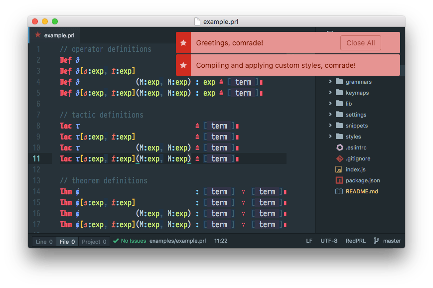

# atom-language-redprl

WIP Atom support for [RedPRL](http://www.redprl.org)



## Installation

Eventually this package will be registered in the Atom package database. In the
meantime, you can check out this repository and create a symbolic link to your
`~/.atom/packages` directory:

```
$ cd ~/github
$ hub clone freebroccolo/atom-language-redprl
$ ln -s atom-language-redprl ~/.atom/packages/language-redprl
```
